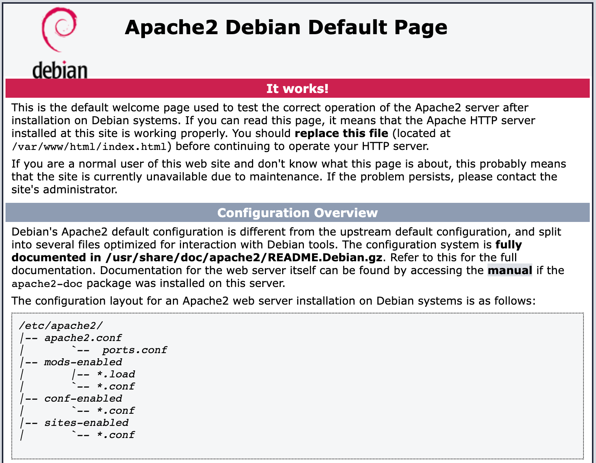

# wp-local-env
[Cross OS WordPress local development environment](https://jonathanbossenger.com/2022/05/25/configuring-ubuntu-in-multipass-for-local-web-development-on-a-macbook/)

## Introduction

wp-local-env is a cross OS (macOS, Windows, Linux) local development environment for WordPress. It is built on top of [Multipass](https://www.docker.com/) for minimal overhead and the fastest possible boot time.

## Requirements

1. [Multipass](https://multipass.run/) - as this is built on top of Multipass, you will need to first install it for your operating system.

You can find the Multipass installation instructions [here](https://multipass.run/install).

2. [mkcert](https://github.com/FiloSottile/mkcert): mkcert is a simple tool for making locally-trusted development certificates which require no configuration.

You can find the mkcert installation instructions [here](https://github.com/FiloSottile/mkcert#installation)

### Recommended mkcert installation for MacOS

1. Install [Homebrew](https://brew.sh/)

```
/bin/bash -c "$(curl -fsSL https://raw.githubusercontent.com/Homebrew/install/HEAD/install.sh)"
```

2. Install mkcert with Homebrew
```
brew install mkcert
brew install nss # if you use Firefox
```

Once mkcert is installed, run the following command to install the root certificate in your local keychain:

```
mkcert -install
```

### Recommended mkcert installation for Linux

1. Install certutil.

```
sudo apt install libnss3-tools
    -or-
sudo yum install nss-tools
    -or-
sudo pacman -S nss
    -or-
sudo zypper install mozilla-nss-tools
```

2. Install [Homebrew](https://brew.sh/)

```
/bin/bash -c "$(curl -fsSL https://raw.githubusercontent.com/Homebrew/install/HEAD/install.sh)"
```

3. Install mkcert with Homebrew
```
brew install mkcert
brew install nss # if you use Firefox
```

Once mkcert is installed, run the following command to install the root certificate in your local keychain:

```
mkcert -install
```

### Recommended mkcert installation for Windows

1. Install [PowerShell](https://docs.microsoft.com/powershell/) terminal.

2. Install [Chocolatey](https://docs.chocolatey.org/en-us/choco/setup#install-with-powershell.exe) package manager for Windows in Powershell

3. Install mkcert with Chocolatey

```
choco install mkcert
```

Once mkcert is installed, run the following command to install the root certificate in your local keychain:

```
mkcert -install
```

## Installation

### macOS

Once you have the [requirements](#Requirements) installed, you can install wp-local-env by running the following command:

```
curl -o- https://raw.githubusercontent.com/jonathanbossenger/wp-local-env/trunk/macos/install.sh > install.sh

chmod +x install.sh

./install
```

#### Installing the hosts record

Once the installer is complete, run the following command to add the initial hosts record to your system:

```
sudo sitehosts
```

This will add a record pointing to the wp-local-env instance and map it to the url `wp-local-env.test`. You can change this url to access the instance in your browser.

If everything worked, you should see the default Debian Apache2 page in your browser.

